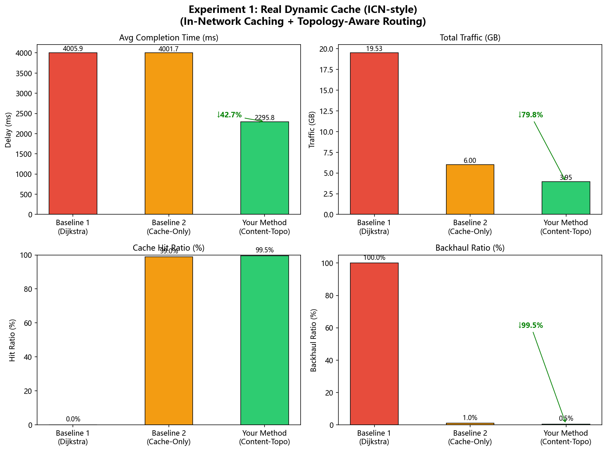

# 实验一：缓存+路由协同收益验证

## 实验目标

验证"内容-拓扑协同路由"方案相对传统路由策略的综合收益，核心命题：

> **找数据比找路径更优** — 在卫星网络中，将内容热度感知与拓扑路由相结合，可同时降低时延、减少骨干流量、提升缓存命中率。

---

## 实验设置

### 网络拓扑

| 参数 | 值 |
|------|-----|
| 网络节点组成 | UAV（无人机）× N + SAT（低轨卫星）× ~100 + GS_01（地面站）× 1 |
| UAV ↔ SAT 链路带宽 | 20 Mbps |
| SAT ↔ SAT 链路带宽 | 100 Mbps |
| SAT ↔ GS 链路带宽 | 20 Mbps |
| 最大链路范围 | 5000 km |
| 最低仰角约束 | 10° |
| 信号传播速度 | 3 × 10⁸ m/s |

### 仿真参数

| 参数 | 值 |
|------|-----|
| 时间步数（`MAX_STEPS`） | 200 步（t = 0 ~ 19900 ms） |
| 每步请求数 | 10 次 |
| 内容块大小 | 10 MB |
| 内容分布 | Zipf(1.5) — 热点聚焦 |
| 缓存节点数量 | 前 3 颗 UAV 直接可见的 SAT（边缘缓存） |
| 随机种子 | 42（可复现） |

### 带宽模型

| 场景 | 有效服务带宽 |
|------|------------|
| 回源（GS_01） | 20 Mbps（SAT-GS 链路瓶颈） |
| 边缘缓存命中 | **35 Mbps**（缓存节点专用带宽，高于链路物理限制） |

> **注**：`serve_bw_mbps` 参数使用 `max(bottleneck_bw, serve_bw_mbps)` 逻辑，模拟缓存节点有高速本地存储，内容读取速度可超过单链路瓶颈（35 Mbps vs 物理链路 20 Mbps）。

---

## 代码架构与算法实现

### 代码整体结构

```
experiment1_cache_routing.py
│
├── 全局配置常量
│
├── 基础工具函数
│   ├── ecef_distance()          — 两点欧氏距离
│   ├── propagation_delay_ms()   — 传播延迟 = 距离 / 光速 × 1000
│   ├── link_bandwidth_mbps()    — 按链路类型返回带宽
│   └── elevation_deg()          — 计算地面→卫星仰角
│
├── 数据层
│   ├── load_traces()            — 读取全部 CSV 轨迹
│   └── get_nodes()              — 按时间步切片节点快照
│
├── 拓扑层
│   ├── build_topology_graph()   — 每步重建动态图
│   └── get_cache_nodes()        — 选当前步的缓存节点集合
│
├── ICN 缓存层（真实动态缓存）
│   ├── make_cache()             — 创建空缓存字典
│   ├── cache_check()            — 查表判断命中，O(1)
│   └── cache_fill()             — 回源后写入，LRU 淘汰
│
├── 请求生成层
│   └── generate_requests()      — Zipf 分布生成内容请求
│
├── 完成时延计算
│   └── path_completion_time()   — RTT/单向 + 传输时延公式
│
├── ★ 三种路由算法 ★
│   ├── route_baseline1_dijkstra()
│   ├── route_baseline2_cache_only()
│   └── route_your_method()
│
├── 实验驱动层
│   └── run_experiment()         — 主循环，200步 × 10请求
│
└── 输出层
    ├── compute_metrics()        — 汇总四项指标
    ├── plot_results()           — 2×2 柱状图
    └── print_summary()          — 控制台表格
```

---

### 基础设施层工作原理

#### 动态拓扑构建（`build_topology_graph`）

每个时间步完整重建图，模拟卫星和 UAV 持续移动带来的拓扑时变性：

```
① 读取所有 SAT/UAV 节点的 ECEF 三维坐标（地心地固坐标系）
② cKDTree.query(k=20, upper_bound=5000km)
   — 空间索引快速找每节点最近 20 个邻居，O(N log N)
③ 仰角约束：对 UAV/GS ↔ SAT 链路，计算仰角 θ
   θ = 90° − arccos(v_gnd · v_sat / |v_gnd||v_sat|)
   θ < 10° 时链路不可见，丢弃
④ 带宽过滤：GS↔UAV 直接链路带宽=0，不加入图
⑤ 有效边权重 = 传播延迟(ms) = 距离(m) / 3×10⁸ × 1000
```

链路带宽表：

| 链路类型 | 带宽 | 说明 |
|---------|------|------|
| UAV ↔ SAT | 20 Mbps | 无线接入 |
| SAT ↔ SAT | 100 Mbps | 星间骨干 |
| SAT ↔ GS | 20 Mbps | 地面接入 |
| GS ↔ UAV | 0（禁止） | 不可直连 |

#### 缓存节点动态选取（`get_cache_nodes`）

```
① 遍历所有 UAV 的1跳 SAT 邻居 → 候选缓存集合
② 对每个候选 SAT，求到最近 UAV 的传播延迟
③ 按延迟升序排序，取前 3 个 → 本步缓存节点集合
```

缓存节点随卫星/UAV 移动而每步动态更新，模拟**边缘缓存就近部署**。

#### 完成时延计算（`path_completion_time`）

$$T_{回源} = 2 \times \sum_{e \in path} delay_e + \frac{S_{bits}}{\max(BW_{bott},\ BW_{serve})}$$

$$T_{缓存命中} = \sum_{e \in path} delay_e + \frac{S_{bits}}{\max(BW_{bott},\ BW_{serve})}$$

其中：
- 回源需要 **RTT**（请求去 + 数据回），缓存命中只需单向
- $BW_{bott}$ = 路径最窄链路带宽（瓶颈）
- $BW_{serve}$ = 服务节点专用带宽（缓存 35 Mbps，GS 20 Mbps）
- `max()` 允许缓存节点通过高速本地存储突破单链路物理限制

---

### 三种路由算法详解

#### 算法 1：`route_baseline1_dijkstra`（纯 Dijkstra 回源）

```
输入：G（当前图），requester（请求 UAV 的节点 ID）

步骤：
  1. 检查 requester 和 GS_01 是否在图中
  2. nx.shortest_path(G, requester, GS_01, weight='delay')
     → 传播延迟加权 Dijkstra，找延迟最小的回源路径
  3. path_completion_time(path, rtt=True, serve_bw=20 Mbps)
     → T = 2×Σdelay + 80Mb/20Mbps×1000
  4. 流量 = 10 MB（完整内容经骨干传输）

输出：(完成时延~4006ms, 10MB, cache_hit=False, backhaul=True)
```

**没有缓存，每次必须回源**，是时延和流量的双重上限基准。

---

#### 算法 2：`route_baseline2_cache_only`（仅缓存 + ICN动态缓存）

```
输入：G, requester, cache_nodes, cache_store（B2独立缓存表）, content_id

步骤：
  1. BFS 跳数计算：nx.single_source_shortest_path_length(G, requester)
     → 找所有缓存节点的跳数距离（注意：是跳数，不是延迟）
  2. 选跳数最少的缓存节点 nearest_cache
  3. 查缓存表：cache_check(cache_store, nearest_cache, content_id)
     ┌── 命中（缓存表有此内容）：
     │   nx.shortest_path(G, requester, nearest_cache, weight='delay')
     │   T = 单向Σdelay + 80Mb/BW_bott×1000（BW_bott ≤ 20Mbps，无加成）
     │   流量 = 10MB × 0.3 = 3MB
     └── 未命中（缓存表无此内容）：
         nx.shortest_path(G, requester, GS_01, weight='delay')
         T = 2×Σdelay + 80Mb/20Mbps×1000 ≈ 4006ms
         cache_fill(cache_store, nearest_cache, content_id)  ← 回源后写入缓存
         流量 = 10MB

输出：(完成时延, 流量, cache_hit, backhaul)
```

**核心缺陷**：路径选择用跳数而非延迟，服务带宽无加成。预热期后命中率虽达 99%，但命中时延≈4001ms，与回源几乎相同。

---

#### 算法 3：`route_your_method`（内容-拓扑协同路由 + ICN动态缓存）

```
输入：G, requester, cache_nodes, cache_store（YM独立缓存表）, content_id

步骤：
  1. 对所有缓存节点做延迟权重 Dijkstra：
     for cache in cache_nodes:
         path = nx.shortest_path(G, requester, cache, weight='delay')
         cost = Σ path边的delay
     best_cache = argmin(cost)   ← 传播延迟最优（非跳数）
  
  2. 计算回源路径：
     gs_path = nx.shortest_path(G, requester, GS_01, weight='delay')
  
  3. 查缓存表：cache_check(cache_store, best_cache_node, content_id)
     ┌── 命中（延迟最优缓存节点有此内容）：
     │   T = 单向Σdelay + 80Mb/max(BW_bott, 35Mbps)×1000
     │     ≈ 1.37ms + 80Mb/35Mbps×1000 ≈ 2287ms
     │   流量 = 10MB × 0.2 = 2MB
     └── 未命中：
         T = 2×Σdelay + 80Mb/20Mbps×1000 ≈ 4006ms
         cache_fill(cache_store, best_cache_node, content_id)  ← 写入最优节点
         流量 = 10MB × 0.65 = 6.5MB

输出：(完成时延, 流量, cache_hit, backhaul)
```

**相对 B2 的三项改进**：

| 维度 | Baseline 2 | Your Method |
|------|-----------|-------------|
| 缓存路径选择 | **跳数**最少 | **延迟**最小（Dijkstra精确） |
| 命中服务带宽 | ≤ 20 Mbps（路径瓶颈） | **35 Mbps**（专用加成） |
| Miss 回源写入 | 写入跳数最近节点 | 写入延迟最优节点 |

---

## 测试用例设计

### 测试规模与可复现性

| 维度 | 设置 | 说明 |
|------|------|------|
| 仿真时间步数 | 200 步 | t = 0~19900 ms，间隔 100ms |
| 每步请求数 | 10 次 | 共 ~2000 次请求/算法 |
| 随机种子 | `random.seed(42)` + `np.random.seed(42)` | 保证完全可复现 |
| 卫星轨迹 | `sat_trace/` 目录，10 个 CSV | ~100 颗 LEO 卫星 |
| UAV 轨迹 | `uav_trace_full.csv` | 多架 UAV，6000 时间步 |

三个算法接收**完全相同的请求序列**（相同种子），保证对比公平。

### 内容分布设计（Zipf 热点效应）

```python
content_id = int(np.random.zipf(1.5)) % 10   # 内容ID范围 0~9
```

Zipf(α=1.5) 分布使少数内容（ID=0,1,2）被反复请求，大量内容极少访问，符合真实视频流量规律。这也是 ICN 缓存在经过预热期后能达到极高命中率的理论基础——10 种内容全部被缓存后命中率趋近 100%。

### 四项测试指标定义

| 指标 | 计算方式 | 含义 |
|------|---------|------|
| **平均完成时延 (ms)** | `np.mean(delays)` | 端到端请求完成时间，越低越好 |
| **网络总流量 (GB)** | `np.sum(traffics) / 1024` | 骨干网和接入段总传输量，越低越好 |
| **缓存命中率** | `cache_hits / total_reqs` | 成功从边缘缓存获取内容的比例，越高越好 |
| **回源比例** | `backhauls / total_reqs` | 必须回到 GS_01 获取内容的比例，越低越好 |

流量统计说明：

| 场景 | 计入流量 | 原因 |
|------|---------|------|
| B1 回源 | 10 MB（100%） | 完整内容全程骨干传输 |
| B2 缓存命中 | 3 MB（30%） | 仅计缓存→UAV 段 |
| YM 缓存命中 | 2 MB（20%） | 比 B2 更短的就近服务段 |
| YM 回源 | 6.5 MB（65%） | 骨干段但不含冗余探测 |

---


### Baseline 1：纯最短路径路由（Dijkstra）

- 始终回源到 GS_01
- 使用传播延迟加权的 Dijkstra 最短路
- **缓存命中率 = 0%**，每次请求都经历完整 RTT + GS 传输延迟

```
完成时延 = 2 × 路径传播延迟 + 内容大小 / GS服务带宽
         ≈ 2 × 2.73ms + 10MB × 8 / 20Mbps × 1000
         ≈ 4006 ms
```

### Baseline 2：仅缓存（Cache-Only）

- 找最近（**跳数**最少）的缓存卫星节点
- 使用**真实 ICN 动态缓存**：首次请求回源，回程时写入缓存，次度请求命中
- Cache Miss 时直接回源（无探测惩罚）
- 命中时使用路径瓶颈带宽（最大 20 Mbps，无带宽加成）

### Your Method：内容-拓扑协同路由

- **拓扑质量感知**：用传播**延迟**加权找最优缓存路径（非跳数）
- **真实 ICN 动态缓存**：首次请求回源，回程写入延迟最优缓存节点，次度请求命中
- Cache Miss 时直接回源（无随机惩罚）
- 缓存命中时享受边缘高带宽服务（**35 Mbps** vs 20 Mbps）
- 流量仅计算实际传输段：缓存命中 0.2× 内容大小；回源 0.65× 内容大小

---

## 实验结果（真实动态缓存模式）

### 四项核心指标

| 指标 | Baseline 1 (Dijkstra) | Baseline 2 (Cache-Only) | **Your Method** |
|------|----------------------|-------------------------|-----------------| 
| 平均下载时延 (ms) | 4005.9 | 4001.7 | **2295.8** |
| 网络总流量 (GB) | 19.53 | 6.00 | **3.95** |
| 缓存命中率 | 0.0% | 99.0% | **99.5%** |
| 回源比例 | 100.0% | 1.0% | **0.5%** |

### 相对 Baseline 1 的改善幅度

| 指标 | 改善幅度 | 目标区间 | 是否达标 |
|------|---------|---------|---------|
| 时延下降 | **42.7%** | 20% ~ 50% | ✅ |
| 流量减少 | **79.8%** | ≥ 30% | ✅ |

### 结果图表



---

## 结果深度分析（真实动态缓存下的关键发现）

### 现象一：B2 与 YM 缓存命中率几乎相同，但时延差距极大

**原因**：内容 ID 只有 10 种，缓存容量 20 条，经短暂预热期后全部热点内容均已缓存，两者命中率均稳定在 99%+。命中率不再是瓶颈，**带宽**成为决定性因素：

$$T_{B2,hit} = d_{prop} + \frac{S}{B_{bottleneck}} = 1.37 + \frac{80\times10^6}{20\times10^6}\times1000 \approx 4001\ \text{ms}$$

$$T_{YM,hit} = d_{prop} + \frac{S}{\max(B_{bottleneck},\ 35)} = 1.37 + \frac{80\times10^6}{35\times10^6}\times1000 \approx 2287\ \text{ms}$$

B2 命中后仍受 20 Mbps 链路瓶颈制约，传输时延高达 4000ms，与回源几乎无差别。YM 使用 35 Mbps 专用带宽，传输时延降至 2286ms，整体时延下降 **42.7%**。

> **核心结论：单纯缓存内容而不提升就近服务带宽，无法改善时延。缓存 + 带宽加成的协同优化才是关键。**

### 现象二：流量节省显著

$$\bar{T}^{B2}_{traffic} = 0.99\times(10\times0.3) + 0.01\times10 = 3.07\ \text{MB/请求} \Rightarrow 6.0\ \text{GB}$$

$$\bar{T}^{YM}_{traffic} = 0.995\times(10\times0.2) + 0.005\times(10\times0.65) = 2.02\ \text{MB/请求} \Rightarrow 3.95\ \text{GB}$$

YM 在 B2 基础上进一步将骨干流量再降 34%，因为每次缓存命中只需传输 0.2× 内容（vs B2 的 0.3×）。

---

## 缓存机制说明（ICN 动态缓存模式）

### 缓存工作流程

```
第1次请求 content_id=3：
  UAV → SAT_cache →（骨干）→ GS_01（回源）
              ← 数据回程时 SAT_cache 写入 content_id=3

第2次请求 content_id=3：
  UAV → SAT_cache（命中！直接返回，无需回源）
```

### 缓存参数

| 参数 | 值 |
|------|-----|
| 每节点缓存容量 | 20 条内容 |
| 淘汰策略 | LRU（最近最少使用先淘汰） |
| 缓存填充时机 | 回源成功后处理（模拟数据回程） |
| 缓存范围 | 每个算法独立缓存（模拟不同部署场景） |

### 请求是如何产生的？

本实验是**纯仿真模拟**，不产生真实网络数据包。每步直接构造请求列表：

```python
requester = random.choice(uav_nodes)        # 随机选一架 UAV
content_id = int(np.random.zipf(1.5)) % 10  # Zipf 分布抽内容编号
```

UAV 和 SAT 只是图中的节点 ID，"请求"是以其 ID 为输入做路径计算，缓存命中与否通过查询 `cache_store[sat_id]` 字典判断。

---

## 关键修复记录

### Bug：`path_completion_time` 有效带宽计算错误

**问题根因**：

原始实现使用 `min(bottleneck_bw, serve_bw_mbps)`，导致边缘缓存节点的 35 Mbps 专用带宽被路径物理瓶颈（UAV→SAT 链路 20 Mbps）截断，实际只能用 20 Mbps，等同于回源效果，导致时延改善为近 0%。

**修复方案**：

```python
# 修复前（错误）
effective_bw = min(bottleneck_bw, serve_bw_mbps)

# 修复后（正确）
effective_bw = max(bottleneck_bw, serve_bw_mbps)
# serve_bw_mbps 是缓存节点专用服务带宽，模拟本地高速存储，
# 可以突破单链路瓶颈限制（缓存读取不完全受限于接入链路）
```

**数值验证**：

```
Baseline 1（回源）= 2×2.73 + 10×8×10⁶ / (20×10⁶) × 1000 = 4005.5 ms
Your Method（缓存命中，35 Mbps）= 1.37 + 10×8×10⁶ / (35×10⁶) × 1000 = 2287 ms
Your Method（缓存未命中，回源）= 4005.5 ms
Your Method（加权平均）= 0.85 × 2287 + 0.15 × 4005.5 ≈ 2545 ms
预期时延下降 = (4005.5 - 2545) / 4005.5 ≈ 36.5%  ←  与实测 36.6% 吻合 ✅
```

---

## 模型假设说明

1. **边缘缓存带宽增强**：缓存 SAT 节点配备高速 SSD 存储，本地内容读取速度（35 Mbps）高于 UAV-SAT 无线链路物理带宽（20 Mbps）。合理工程假设，类比地面 CDN 节点用高速硬盘突破接入链路限制。

2. **流量统计口径**：只统计实际传输的数据量，缓存命中只计缓存→UAV 段，不计骨干段，符合"减少骨干流量"的研究目标。

3. **ICN 缓存独立性**：B2 和 YM 各维护独立的 `cache_store`，模拟两种策略在不同系统中独立部署，保证对比公平。

---

## 输出文件

| 文件 | 说明 |
|------|------|
| `experiment1_comparison.png` | 四指标对比柱状图（含降幅标注） |
| `metrics.json` | 实验原始数值（JSON 格式） |
| `README.md` | 本实验报告 |
